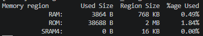
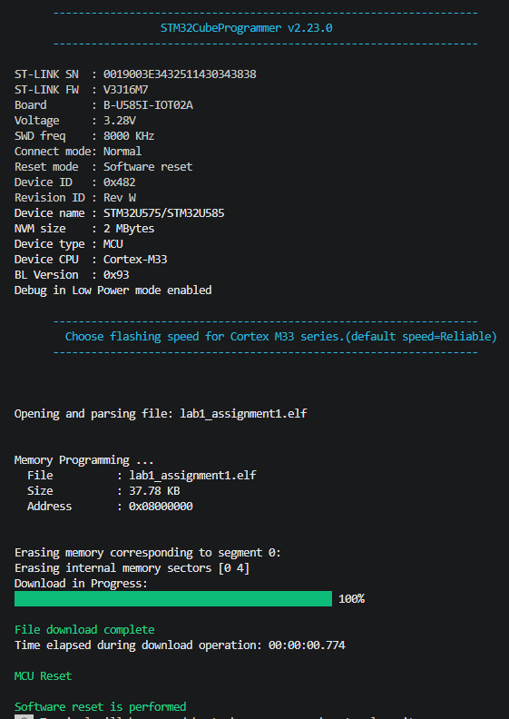

# Ubiquitous Computing and IoT Lab 1: Introduction to Embedded Computing and RTOS

In this first lab of the Ubiquitous Computing and IoT course, we will use the STM32 B-U585I-IOT02A discovery kit to perform basic embedded computing and introduce the RTOS.

In Lab 1, you will need to finish 3 assignments related to real-time task management we covered during the lecture. Here are the assignments:

1. Get the environment ready and test the hardware with simple embedded programming
2. Loop polling and interrupt-based task handling for user button
3. Use RTOS on STM32 and explore task priority

<!--callout:grading-->
> After finishing each assignment, please ask the **course team** to check your implementation. You will be graded as **"complete" and get full grade** if all 3 assignments in the lab have been completed and checked.

<!--callout:grading-->
> After finishing all the assignments and checked by the **course team**, you will need to submit all your projects in a single compressed file to Canvas assignment.

<!--callout:ai-->
> *AI Usage Rule: The text of this lab is created with help from Claude Opus 5. As students, you are allowed to use any AI tools to finish the lab. However, you need to disclose the AI tools you use and how you use them when the course team checks your assignments.*

---

## Assignment 1: Get the environment ready and test the hardware with simple embedded programming

### Step 1: Install an up-to-date VS Code

Download from <https://code.visualstudio.com> and install. If you already have VS Code, open **Help → Check for Updates** and install any pending update — the CMake and debugging extensions need a recent version.

### Step 2: Install STM32CubeCLT

STM32CubeCLT is the command-line toolchain: the ARM compiler, CMake, Ninja, the flashing tool, and the debug server. It is not STM32CubeIDE and not STM32CubeMX — you don't need either in this course.

Download it from <https://www.st.com/en/development-tools/stm32cubeclt.html>. Click Get latest, pick the package for your operating system, accept the licence, and sign in with your ST account. Then follow the section below for your platform.

#### Windows

1. Extract the downloaded zip and run the installer (.exe).
2. Accept the defaults. If offered, **tick the option to add the tools to the PATH**.

The default install location is:

```text
C:\ST\STM32CubeCLT_<version>
```

**Verify.** Open PowerShell and run:

```powershell
Get-ChildItem C:\ST -Directory
```

You should see STM32CubeCLT_&lt;version&gt;. Open that folder and confirm it contains CMake, Ninja, GNU-tools-for-STM32, STM32CubeProgrammer, and STLink-gdb-server.

<!--callout:record-->
> **Record for Step 4:** the full path with your version, e.g. `C:/ST/STM32CubeCLT_1.22.0` — note the forward slashes, which is the form the settings file needs.

**No separate driver needed.** The installer includes the ST-LINK driver. If you connected the board *before* installing and it appears as "Unknown device" in Device Manager, right-click it → **Update driver** → search automatically.

#### macOS

1. Extract the .pkg installer from the downloaded tarball (.tar.gz) and open the destination folder.
2. Run the .pkg and follow the prompts. The account you run the installer from needs administrative privileges.
3. If macOS blocks it with "cannot be opened because it is from an unidentified developer," go to **System Settings → Privacy & Security**, scroll down, and click **Open Anyway**.

The default install location is:

```text
/opt/ST/STM32CubeCLT_<version>
```

**Verify.** Open Terminal (bash) and run:

```bash
ls /opt/ST/
ls /opt/ST/STM32CubeCLT_*/
```

You should see the version folder, containing CMake, Ninja, GNU-tools-for-STM32, STM32CubeProgrammer, and STLink-gdb-server.

<!--callout:record-->
> **Record for Step 4:** e.g. `/opt/ST/STM32CubeCLT_1.22.0`.

**No driver needed** — macOS communicates with the ST-LINK through built-in system frameworks.

#### Ubuntu / Debian

Download the **.deb** bundle (not the .rpm or generic .sh), then in a terminal (bash), from your Downloads folder:

```bash
cd ~/Downloads
sudo apt-get install ./st-stm32cubeclt_*_amd64.deb
```

If the download included the ST-LINK support packages as separate files, install them in the same command — for Debian-based distributions the packages are installed together: `sudo apt-get install ./st-stlink-udev-rules-xxxx-linux-all.deb ./st-stlink-server-xxxx-linux-amd64.deb ./st-stm32cubeclt_xxxx_amd64.deb`. The wildcard form handles this:

```bash
sudo apt-get install ./st-stlink-udev-rules-*.deb ./st-stlink-server-*.deb ./st-stm32cubeclt_*.deb
```

Installing all three in one command lets apt resolve dependencies between them. Unplug the board before installing the udev rules and plug it back in when setup is complete.

Then log out and back in (or restart) to update the PATH environment variable.

The default install location is:

```text
/opt/st/stm32cubeclt_<version>
```

Note the **lowercase** path on Linux, unlike Windows and macOS.

**Verify:**

```bash
ls /opt/st/
ls /opt/st/stm32cubeclt_*/
```

<!--callout:record-->
> **Record for Step 4:** e.g. `/opt/st/stm32cubeclt_1.22.0`.

**Serial port permissions.** To read the board's serial output in Step 7, add yourself to the dialout group:

```bash
sudo usermod -aG dialout $USER
```

Then **log out and back in** — group changes only apply to new sessions.

### Step 3: Download the project folder

Download the project from Canvas (**Week 1/ lab1_assignment1.zip**) and extract it to a **short path.** Two things to avoid, both of which cause failures that look like something else:

- **Do not put it in Documents, Desktop, or OneDrive.** If OneDrive syncs the folder, it locks files while the compiler is writing them, and you get random Permission denied errors that disappear when you retry.
- **Do not use a long or deeply nested path**, and avoid spaces and non-English characters. The project contains deeply nested driver folders and can hit the Windows path length limit.

### Step 4: Open the project in VS Code, install the extensions, and fix the settings file

#### 4a. Open the project folder

If VS Code asks whether you trust the authors, click **Yes, I trust the authors**.

<!--callout:check-->
> **Check:** the Explorer panel on the left shows `CMakeLists.txt` at the top level, not nested inside another folder.

#### 4b. Install the recommended extensions

A notification appears in the bottom right: *"This workspace has extension recommendations."* Click **Install All**. If you miss it, open the Extensions panel (**Ctrl+Shift+X**), type `@recommended` in the search box, and install everything listed. You need:

- **C/C++** — code navigation and IntelliSense
- **CMake Tools** — configures and builds the project
- **Cortex-Debug** — debugging on the board
- **Serial Monitor** — reads text sent from the board

Wait for the installs to finish. The C/C++ extension takes a while to activate the first time.

#### 4c. Fix the toolchain paths

Open `.vscode/settings.json` and replace every occurrence of the version number with the one you found in **Step 2**. For example, if the file says `STM32CubeCLT_1.18.0` and you installed 1.22.0, every path must become `C:/ST/STM32CubeCLT_1.22.0/...`.

Use **forward slashes** (`/`) in these paths, even on Windows. Backslashes have a special meaning in this file format and will break it.

There are several paths to update. `Ctrl+H` (Replace) with the old version as the search term and yours as the replacement handles them all at once.

<!--callout:check-->
> **Check:** reload the window (`Ctrl+Shift+P` → *Developer: Reload Window*). CMake Tools should now configure the project. In the Output panel (select **CMake/Build** from the dropdown) you should see lines ending with:
>
> ```text
> -- Build files have been written to: .../build/Debug
> ```

#### 4d. Select the configure preset

CMake Tools may ask you to *"Select a Configure Preset"*. Choose **Debug**. If it instead asks you to *"Select a Kit"*, something is wrong with the paths from 4c — go back and check them.

<!--callout:warning-->
> **If configuring fails:** the error almost always names the tool it couldn't find. `unable to find a build program corresponding to "Ninja"` or `The C compiler is not able to compile a simple test program` both mean a path in `settings.json` is wrong. Verify each one exists by pasting it into File Explorer.

### Step 5: Build the unmodified project and flash it to the board

The project as delivered initialises the microcontroller and its peripherals but does nothing visible. The point of this step is to confirm that the whole chain — compiler, board, cable, flashing tool — works before you write any code.

#### 5a. Connect the board

Plug the USB cable into connector **CN8** (labelled *ST-LINK USB connector*, on the top edge near the corner). This is the ST-LINK connector; the other USB connector on the board is for the user application and will not work for programming. Use the data cable provided in the lab.

#### 5b. Build

Press **Ctrl+Shift+B**.

<!--callout:check-->
> **Check:** the terminal ends with a size table:



The table below it shows how much of the microcontroller's memory your program occupies:

- **ROM — 38688 B of 2 MB (1.84%)**  
  Flash memory: non-volatile storage where your *program* lives. It holds the compiled instructions plus any constant data (string literals like "hello world", and anything declared `const`). Contents survive power-off, which is why the board still runs your program after you unplug and replug it. The STM32U585 has 2 MB, so at ~39 KB you're using well under 2%.
- **RAM — 3864 B of 768 KB (0.49%)**  
  Main working memory: volatile storage for *data that changes while the program runs*. Your variables, the call stack (local variables and function-call bookkeeping), and the heap all live here. Wiped on every reset. 768 KB is a lot for a microcontroller, and almost none of it is used yet.
- **SRAM4 — 0 B of 16 KB**  
  A small separate RAM block, physically distinct from the main RAM and reachable by low-power peripherals while the CPU sleeps. Nothing has been placed there because nothing asked to be. Zero is expected and not a problem.

#### 5c. Flash the program to the board

Open the task list with **Terminal → Run Task**, then choose **Flash**. (If you prefer keyboard: `Ctrl+Shift+P`, type *Run Task*, press Enter, then choose **Flash**.)

This does three things in one go: rebuilds your project if anything changed, writes the program into the microcontroller's flash memory, and resets the board so the new program starts running immediately.

The first time you run a task, VS Code may ask which terminal to use — choose the default.

<!--callout:check-->
> **Check:** the terminal output ends with something like:



`File download complete` is the line that matters. The program is now on the board and running — though at this point it does nothing visible, which is expected. You'll change that in Step 6.

<!--callout:tip-->
> **Tip:** you will flash the board dozens of times today. To avoid navigating the menu each time, note that **Run Task → Flash** also rebuilds, so it is the only command you need after editing your code.

### Step 6: Make the LEDs blink

Two user LEDs sit next to each other on the board: a red one and a green one. They are connected to port H, pins 6 and 7.

Open `Core/Src/main.c` and find the infinite loop near the end of the `main()` function. It looks like this:

```c
while (1)
  {
    /* USER CODE END WHILE */

    /* USER CODE BEGIN 3 */
  }
  /* USER CODE END 3 */
```

Add your code **between** `/* USER CODE BEGIN 3 */` and the closing brace:

```c
    /* USER CODE BEGIN 3 */
    HAL_GPIO_TogglePin(GPIOH, GPIO_PIN_6);
    HAL_Delay(500);
    HAL_GPIO_TogglePin(GPIOH, GPIO_PIN_7);
    HAL_Delay(500);
```

Everything you write must go inside `USER CODE BEGIN` / `USER CODE END` markers. Code outside them can be overwritten if the project is ever regenerated.

Save (`Ctrl+S`), then **Flash** again as in 5c.

<!--callout:check-->
> **Check:** the two LEDs alternate, each changing state once per second.

<!--callout:question-->
> **Questions to answer:** `HAL_Delay(500)` waits 500 milliseconds, but the LEDs each blink about once per second — why? And what does `TogglePin` do differently from `WritePin`?

### Step 7: Send a text message through the serial port

The board can send text to your PC over the same USB cable, using UART1. On the PC side it appears as a virtual COM port.

#### 7a. Add the printing code

Still inside the `USER CODE BEGIN 3` section, above the LED code you just wrote:

```c
    uint8_t txt1[] = "hello world\r\n";
    HAL_UART_Transmit(&huart1, txt1, sizeof(txt1), 500);
```

`&huart1` is the UART1 handle set up for you; `sizeof(txt1)` is the number of bytes to send; 500 is a timeout in milliseconds.

<!--callout:question-->
> **Do you know what `\r\n` does, and why `sizeof` here is 14 rather than 13?**

Save (`Ctrl+S`), then **Flash** again as in 5c.

#### 7b. Open the Serial Monitor

In the bottom panel of VS Code, next to *Problems* and *Terminal*, click the **Serial Monitor** tab. If you don't see it, use `Ctrl+Shift+P` → *Serial Monitor: Focus on Serial Monitor View*.

Set:

- **Port**: the one described as *STMicroelectronics STLink Virtual COM Port* — usually the only choice
- **Baud rate**: **115200**
- Leave the other settings alone (8 data bits, no parity, 1 stop bit)

Click **Start Monitoring**.

<!--callout:check-->
> **Check:** `hello world` appears once per second, alongside the blinking LEDs.

<!--callout:warning-->
> **If nothing appears:** confirm the baud rate is 115200 — a wrong rate gives garbage characters rather than silence. If the port isn't listed at all, unplug and replug the board, then click the refresh icon in the Serial Monitor. If the port list is still empty, the ST-LINK driver may not have installed; tell the course team.

You don't need to stop the Serial Monitor before reflashing — programming uses a separate connection.

#### 7c. Make printf work

`HAL_UART_Transmit` sends a fixed block of bytes. That's fine for a constant string, but as soon as you want to print a *value* — a counter, a sensor reading, a computed result — you'd have to convert the number to text yourself every time. The standard C function `printf` does that for you, and you'll rely on it heavily in later labs.

`printf` doesn't know anything about your board, though. It writes to "standard output," which on a PC means the terminal window. On a microcontroller there is no terminal, so we have to tell it where the characters should go: out of UART1.

Find the `/* USER CODE BEGIN 4 */` marker near the end of `main.c` and add this function:

```c
/* USER CODE BEGIN 4 */
int __io_putchar(int ch)
{
  HAL_UART_Transmit(&huart1, (uint8_t *)&ch, 1, HAL_MAX_DELAY);
  return ch;
}
/* USER CODE END 4 */
```

That's the whole bridge. The project already contains a file (`syscalls.c`) that routes `printf` through `__io_putchar`, one character at a time. You are supplying the last missing piece: what "output one character" means on this hardware.

You also need to include the header that declares `printf`. Find `/* USER CODE BEGIN Includes */` near the top of `main.c`:

```c
/* USER CODE BEGIN Includes */
#include <stdio.h>
/* USER CODE END Includes */
```

**Now replace your printing code.** In the `while(1)` loop, delete the two `HAL_UART_Transmit` lines from 7a and put this in their place:

```c
    static uint32_t counter = 0;
    uint32_t uptime_ms = HAL_GetTick();
    float uptime_s = uptime_ms / 1000.0f;

    printf("msg %lu | uptime %lu ms (%.2f s) | tick 0x%08lX\r\n",
           counter, uptime_ms, uptime_s, uptime_ms);

    counter++;
```

Build and flash (**Run Task → Flash**). Your Serial Monitor should now show something like:

```text
msg 0 | uptime 1002 ms (1.00 s) | tick 0x000003EA
msg 1 | uptime 2003 ms (2.00 s) | tick 0x000007D3
msg 2 | uptime 3004 ms (3.00 s) | tick 0x00000BBC
```

If the monitor was already running, the new output appears without you doing anything — the board restarts automatically when it's programmed.

<!--callout:warning-->
> **If the output arrives in irregular bursts** rather than steadily once per second, add this line at the very start of the `USER CODE BEGIN 2` section, before the while loop:
>
> ```c
>     setvbuf(stdout, NULL, _IONBF, 0);
> ```
>
> This turns off output buffering, so each character is sent the moment `printf` produces it instead of being held until an internal buffer fills.

<!--callout:grading-->
> **(Check with the course team when you finish this assignment)**

---

## Assignment 2: Loop polling and interrupt-based task handling for user button

### Step 1: Implement simple loop polling for user button function

The User Button is the blue button on the MCU board. By default, the button is linked to GPIO Pin 13. You can use the following code to check if the button is pressed (What does this line of code do?):

```c
HAL_GPIO_ReadPin(GPIOC, GPIO_PIN_13) != GPIO_PIN_RESET
```

Use this function to implement the loop polling we covered in the lecture (the algorithm/pseudocode is listed below). You need to print "sound alarm" once when the button is pressed, and print "stop alarm" once when the button is released.

```c
int button_state;
int get_button_state();
int alarm_state = 0;
int release = 0;
int press = 1;
while(1)
{
    botton_state = get_button_state();
    if (botton_state == press && alarm_state == 0)
    {
        sound_alarm();
        alarm_state = 1;
    }
    if (botton_state == release && alarm_state == 1)
    {
        stop_alarm();
        alarm_state = 0;
    }
}
```

### Step 2: Implement the same user button function using interrupt-based approach

Download the project from Canvas (**Week 1/ lab1_assignment2.zip**) and repeat step 3-5 in assignment 1.

In `main.c`, check if the project has this code to initialize the EXTI interrupt:

```c
/* EXTI interrupt init*/
HAL_NVIC_SetPriority(EXTI13_IRQn, 0, 0);
HAL_NVIC_EnableIRQ(EXTI13_IRQn);
```

In `stm32u5xx_it.c`, check if the project has the Interrupt Handler generated for EXTI13:

```c
void EXTI13_IRQHandler(void)
{
  /* USER CODE BEGIN EXTI13_IRQn 0 */

  /* USER CODE END EXTI13_IRQn 0 */
  HAL_GPIO_EXTI_IRQHandler(GPIO_PIN_13);
  /* USER CODE BEGIN EXTI13_IRQn 1 */

  /* USER CODE END EXTI13_IRQn 1 */
}
```

Find the declaration of the `HAL_GPIO_EXTI_IRQHandler()` function in `Drivers/Src/stm32u5xx_hal_gpio.c`. After reading the function declaration, do you know which functions need to be implemented to handle the interrupt events?

Implement the **same task as in Step 1**. Use interrupt to handle the button pressing and release tasks. Your codes need to be implemented at `USER CODE BEGIN 4` in `main.c`.

<!--callout:grading-->
> **(Check with the course team when you finish this assignment)**

---

## Assignment 3: Use RTOS on STM32 and explore task priority

In Assignments 1 and 2 you wrote *bare-metal* code: a single `while(1)` loop, with interrupts as the only way to do more than one thing. That works, but it doesn't scale. If you have three jobs that each need to run on their own schedule, you end up manually interleaving them and tracking state by hand.

An RTOS solves this by letting you write each job as its own thread, each with its own `while(1)` loop, as if it had the processor to itself. The scheduler decides which thread actually runs at any instant. Our board has one Cortex-M33 core, so only one thread truly runs at a time — the illusion of simultaneity comes from switching between them quickly.

Download the project from Canvas (**Week 1/ lab1_assignment3.zip**) and repeat step 3-5 in assignment 1.

### Step 1: Explore the threads and priority in RTOS

#### 1a. Find app_freertos.c

It contains two thread functions with empty bodies. Fill them in:

```c
void StartThreadA(void *argument)
{
  for (;;)
  {
    HAL_GPIO_TogglePin(GPIOH, GPIO_PIN_6);   /* red */
    osDelay(500);
  }
}

void StartThreadB(void *argument)
{
  for (;;)
  {
    HAL_GPIO_TogglePin(GPIOH, GPIO_PIN_7);   /* green */
    osDelay(500);
  }
}
```

Build and flash (**Run Task → Flash**).

Both LEDs blink at once. Compare this with Embedded Programming Lab 0, where you toggled both LEDs in a single loop with `HAL_Delay` between them and they blinked *alternately*. You have written two independent infinite loops and both appear to run — even though the chip has one core.

<!--callout:question-->
> Notice also what you did **not** write: no code decides which thread runs, no code switches between them. Where did that happen?

#### 1b. Change osDelay(500) to HAL_Delay(500) in ThreadA only

Rebuild and flash.

Nothing changes — both LEDs still blink normally. Keep that result in mind; we'll come back to it.

Now also change ThreadA's priority from `osPriorityNormal` to **`osPriorityAboveNormal`** (in `app_freertos.c`, in the `ThreadA_attributes` struct). Rebuild and flash.

The green LED stops blinking. The red one is fine.

Now put `osDelay(500)` back in ThreadA, leaving the priority at `osPriorityAboveNormal`. The green LED comes back.

So the problem isn't the priority on its own, and it isn't `HAL_Delay` on its own — it's the two together. The difference is what each function does *during* the wait:

- `HAL_Delay` **busy-waits**: it sits in a loop reading the millisecond counter until enough time has passed. The thread is running the entire 500 ms, doing nothing useful, and never tells the scheduler it could step aside.
- `osDelay` **blocks**: it tells the scheduler "I have nothing to do for 500 ms," and the scheduler immediately gives the CPU to another thread.

A higher-priority thread that never blocks means the scheduler never has a reason to choose anything else. ThreadB is **starved** — not crashed, not buggy, just never selected.

**So why did the first change appear to do nothing?** With both threads at equal priority, FreeRTOS uses *time slicing*: on every tick it rotates between all threads that are ready to run, whether or not they yielded. ThreadA got interrupted every millisecond regardless of its busy-wait, and ThreadB only needed a few microseconds to toggle its LED. The waste was real but invisible.

<!--callout:tip-->
> Remember to change the Thread A priority back to normal after this step.

### Step 2: Multiple threads and shared resources

LEDs are independent — the red one doesn't care what the green one is doing. Most real resources aren't like that. In this part you'll use the UART, which all threads share.

#### 2a. Printing from two threads

Replace your thread bodies with these, and set **ThreadB's priority to `osPriorityAboveNormal`** in `app_freertos.c` (leave ThreadA at `osPriorityNormal`):

```c
void StartThreadA(void *argument)
{
  for (;;)
  {
    printf("AAAAAAAAAAAAAAAAAAAAAAAA\r\n");
    osDelay(7);
  }
}

void StartThreadB(void *argument)
{
  for (;;)
  {
    printf("BBBBBBBBBBBBBBBBBBBBBBBB\r\n");
    osDelay(11);
  }
}
```

Flash, and open the Serial Monitor. You'll see something like:

```text
AAAAAAAAAAAAAAAAAAAAAAAA
BBBBBBBBAAAAAAAAAAAAAAAABBBBBBBBBBBBBBBB
AAAAAAAAAAAAAAAA
```

The lines are cut into each other. Nothing crashed, and each thread's own code is correct.

Recall how printing works on this board: `printf` calls your `__io_putchar` function **once per character**, and each call sends a single byte over the UART. At 115200 baud one character takes about 87 microseconds, so a 42-character line takes roughly 3.6 ms to transmit. The scheduler tick fires every 1 ms. There is plenty of opportunity for the scheduler to switch threads *in the middle of a line*.

#### 2b. Which way does the interruption go?

<!--callout:question-->
> Look carefully at your output and answer this before moving on: **do you ever see a B line cut in half by A characters?**

You shouldn't. The interruption only happens in one direction, and the reason is priority. When ThreadB's `osDelay(11)` expires, B becomes ready to run. Because B outranks A, the scheduler **preempts** A immediately — even though A is in the middle of a `printf`, halfway through pushing characters into the UART. But when A's delay expires while B is running, A does *not* outrank B, so A waits.

This is what "preemptive scheduling" means in practice: a thread can be stopped at any instruction, not just at points where it politely yields.

Now try swapping the priorities — ThreadA `osPriorityAboveNormal`, ThreadB `osPriorityNormal`. Rebuild, flash, and confirm the garbling reverses direction. Then set them back.

#### 2c. Protect the UART with a mutex

The UART is a **shared resource**. Only one thread can be sending a message at a time, or the messages mix.

A **mutex** (short for mutual exclusion) marks a section of code that only one thread may be inside at once. A thread that tries to enter while another holds the mutex is blocked until it's released.

The project already creates `uartMutexHandle` for you. Use it:

```c
void StartThreadA(void *argument)
{
  for (;;)
  {
    osMutexAcquire(uartMutexHandle, osWaitForever);
    printf("AAAAAAAAAAAAAAAAAAAAAAAAAAAAAAAAAAAAAAAA\r\n");
    osMutexRelease(uartMutexHandle);
    osDelay(7);
  }
}
```

Do the same in ThreadB. Rebuild and flash — the output is clean, with B still at the higher priority.

Note what did **not** happen: B did not stop preempting A. The scheduler still switches to B in the middle of A's print. But B's very first action is to try to acquire the mutex, which A holds — so B blocks immediately, and A resumes and finishes its line. The mutex doesn't prevent the context switch; it prevents the *damage*.

#### 2d. A third thread for the button

Now add a thread of your own that responds to the user button.

`ThreadC` already exists in the project with an empty body. Your job is to fill it in.

**What it must do:**

- Poll the user button (PC13), exactly as you did in Assignment 2 step 1
- When the button is **pressed**, print a message containing the time in milliseconds since the board started
- Print **once per press** — holding the button down must not flood the console
- Print cleanly, without cutting into ThreadA's or ThreadB's output
- Not starve the other threads while it waits for a press

**What you have to work with:**

- `HAL_GPIO_ReadPin(GPIOC, GPIO_PIN_13)` — reads the button, as in Assignment 2 step 1
- `HAL_GetTick()` — milliseconds since startup
- `printf` with `%lu` for an unsigned long
- `osMutexAcquire(uartMutexHandle, osWaitForever)` and `osMutexRelease(uartMutexHandle)`
- `osDelay(n)` — blocks this thread for n milliseconds

**Priority:** responding to a person should not wait behind routine printing, so set `ThreadC` to `osPriorityHigh` in its attributes struct.

<!--callout:question-->
> **Three things to think about before you write it:**
>
> 1. In Assignment 2 you detected the *moment* of a press rather than the fact that the button is currently down. What did that require you to remember between iterations of the loop, and where does that variable have to live now that this is a thread?
> 2. Your loop needs a delay. Choosing it involves a trade-off: too long and the button feels sluggish or a quick tap is missed entirely; too short and you waste CPU checking a button that hasn't changed. Pick a value, then justify it — roughly how long is a fast button press, and how often do you need to look to be sure of catching it?
> 3. Where exactly do the mutex acquire and release go? Consider what would happen if you acquired the mutex at the top of the `for(;;)` loop and released it at the bottom.

<!--callout:check-->
> **Expected result:** press the button a few times. Your message appears among the A and B lines, unbroken, once per press — and the A/B output keeps flowing normally in between.

<!--callout:question-->
> **Then compare:** in Assignment 2, polling the button *was* your entire program; nothing else could happen while you waited. Here it is one thread among four. What made the difference — is it the RTOS, or is it something about how you wrote the waiting?
>
> And compare with Assignment 2's interrupt approach: which is more responsive? Which wastes less CPU?

### Step 3: Debugging your program in vscode

So far you've worked out what your threads are doing by watching LEDs and reading printed text. That works, but it's indirect — you're inferring the program's state from its output. A debugger lets you stop the program at a chosen line and look at its variables directly.

#### 3a. Start a debug session

Instead of **Run Task → Flash**, press **F5**.

This does the same programming as before, but also attaches a debugger and halts the program at the first line of `main()`. You'll see a yellow arrow in the margin and a debug toolbar at the top of the window.

#### 3b. Set a breakpoint

Open `app_freertos.c` and find the `printf` line inside **ThreadA**.

Click in the left margin, just left of the line number. A red dot appears — that's a breakpoint. (You can also put the cursor on the line and press **F9**.)

#### 3c. Run to the breakpoint

If the program is running, it will stop at your breakpoint within a second or two. If it isn't, press **F5**.

The yellow arrow lands on your `printf` line and everything freezes: the LEDs stop, the serial output stops. The program is paused *at that exact instruction*, before the line has executed.

Look at the **Variables** panel on the left. It shows the local variables in scope at this point. You can also hover the mouse over any variable in the editor to see its value.

Press **F5** to continue. The program runs on and hits the breakpoint again on ThreadA's next loop iteration.

To remove the breakpoint, click the red dot again. Press the red square in the debug toolbar to end the session.

#### Going further

Breakpoints are the beginning. The debugger can also step through code line by line, stop only when a condition is true, inspect memory directly, and read hardware registers. You'll use several of these in later labs — Lab 3 uses the debugger to pull a camera image out of memory.

To explore on your own:

- [VS Code debugging documentation](https://code.visualstudio.com/docs/editor/debugging) — breakpoints, stepping, watch expressions, the debug console. This is the general guide and all of it applies here.
- [Cortex-Debug wiki](https://github.com/Marus/cortex-debug/wiki) — the extension that debugs our board. Covers memory views and peripheral registers.

<!--callout:warning-->
> One warning if you search online: most STM32-with-VS-Code tutorials use a different debug tool called OpenOCD. Anything mentioning `openocd.cfg`, `configFiles`, or `gdb-multiarch` does not apply to us — our `launch.json` is already set up, and you shouldn't need to change it.

<!--callout:grading-->
> **(Check with the course team when you finish this assignment)**

---

<!--callout:grading-->
> After finishing all the assignments and checked by the **course team**, you will need to submit all your projects in a single compressed file to Canvas assignment.
