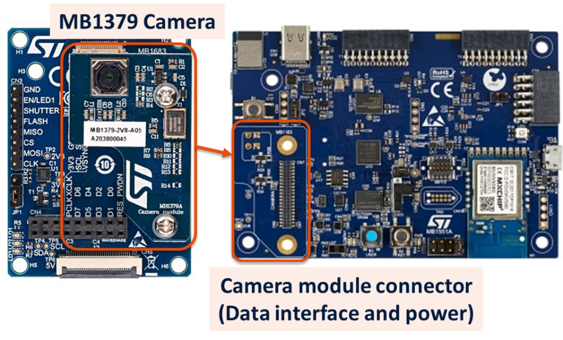
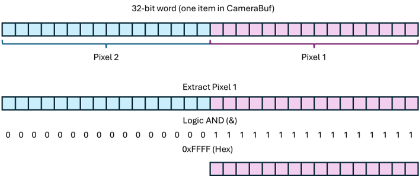
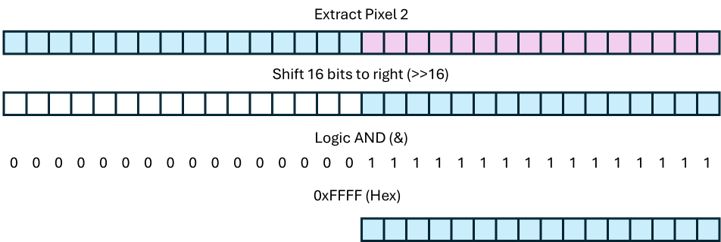
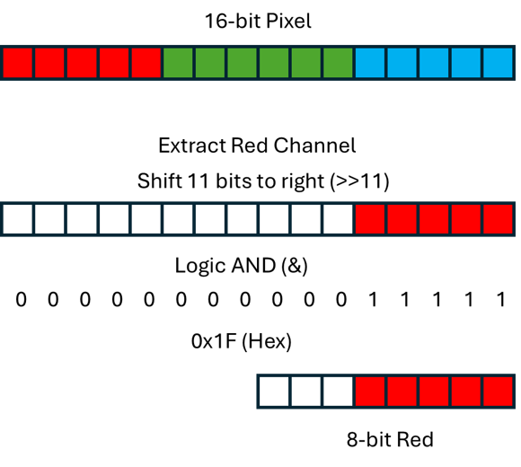
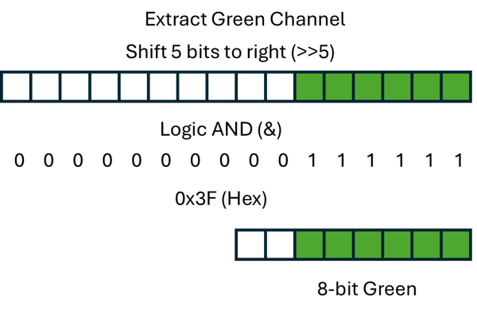
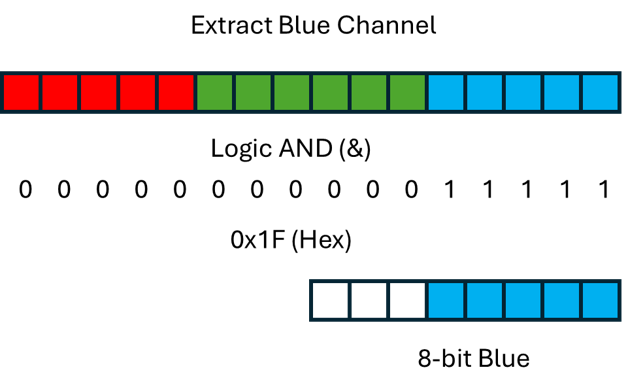
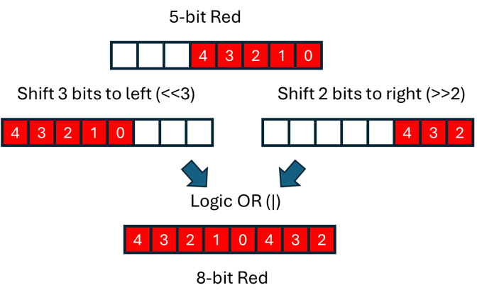

# Ubiquitous Computing and IoT Lab 2: Embedded camera and computer vision

In the second lab of the Ubiquitous Computing and IoT course, we will use the MB1379 camera module with the STM32 B-U585I-IOT02A discovery kit to perform basic computer vision and image processing on the STM32 embedded processor.

In the lab session, you will receive a board with the camera module already connected. See the figure below on how the boards are connected:



Lab 2 and the example project setup is partially based on *"DigiKey introduction on Using a Camera Module with the B-U585I-IOT02A Discovery Board by Matt Mielke, https://forum.digikey.com/t/using-a-camera-module-with-the-b-u585i-iot02a-discovery-board/27245"*.

We will use the same development environment as in Lab 1: **VS Code with STM32CubeCLT and CMake**. If you have not set that up yet, or if you are on a different machine than in the previous lab, work through Assignment 1 Steps 1–4 of the [Lab 1 document](../Lab%201/Lab1_Embedded_Computing_and_RTOS.md) first. This lab assumes you already have a working toolchain, that you know how to build with `Ctrl+Shift+B`, how to flash with **Run Task → Flash**, and how to start a debug session with `F5`.

In Lab 2, you will need to finish 3 assignments. Here are the assignments:

1. Set up the camera project and view the captured image
2. Basic on-board image processing and convert the RGB image to grayscale
3. Implement a basic motion detection system

> After finishing each assignment, please ask the **course team** to check your implementation. You will be graded as **"complete" and get full grade** if all 3 assignments in the lab have been completed and checked.
>
> After finishing all the assignments and checked by the **course team**, you will need to submit all your projects in a single compressed file to the Canvas assignment.
>
> *AI Usage Rule: The text of this lab is created with help from Claude Opus 5. As students, you are allowed to use any AI tools to finish the lab. However, you need to disclose the AI tools you use and how you use them when the course team checks your assignments.*

---

## Assignment 1: Set up the camera project and view the captured image

The board has no display. That single fact shapes this whole assignment: the camera can produce an image, but you have no way to look at it without moving it to your PC first. By the end of this assignment you will have taken a photo with the board and be looking at it as a PNG on your laptop.

### Step 1: Get the project onto your machine

Download the project from Canvas (**Week 2 / b-u585i-iot02a_camera.zip**) and extract it.

The same two warnings from Lab 1 apply, and they matter more here because this project contains deeply nested driver folders:

- **Do not put it in Documents, Desktop, or OneDrive.** A syncing folder locks files while the compiler is writing them.
- **Use a short path**, without spaces or non-English characters. This project ships the camera driver and the board support package inside `Drivers/`, and on Windows the nesting can hit the path length limit.

Open the folder in VS Code, install the recommended extensions if you are prompted, and update the toolchain paths in `.vscode/settings.json` to match your STM32CubeCLT version — exactly as in [Lab 1, Assignment 1, Step 4](../Lab%201/Lab1_Embedded_Computing_and_RTOS.md#step-4-open-the-project-in-vs-code-install-the-extensions-and-fix-the-settings-file). If you copy the `settings.json` from your working Lab 1 project, that works too.

> **Check:** the Explorer panel shows `CMakeLists.txt` at the top level, and the Output panel (**CMake/Build**) ends with `-- Build files have been written to: .../build/Debug`.

### Step 2: Build and flash the unmodified project

Connect the board to **CN8** (the ST-LINK USB connector) and press **Ctrl+Shift+B**.

> **Check:** the build ends with the memory size table. Compare it with what you saw in Lab 1:
>
> ```
> RAM:      616584 B       768 KB     78.40%
> ```
>
> In Lab 1 you used 0.49% of RAM. Here you are using nearly 80% of it, and you have not written a single line of code yet.

That number comes from one array. The camera produces a 640×480 image in RGB565 format, where every pixel takes 2 bytes. 640 × 480 × 2 = 614400 bytes, or 600 KiB, out of the 768 KiB the STM32U585 has. This is the central constraint of embedded computer vision: on a PC you would not think twice about a VGA image, but here a single uncompressed frame nearly fills the machine.

> **Question to keep in mind for Assignment 3:** you will eventually need to hold *two* frames at once to compare them. What does that tell you about the resolution you will be able to use?

Now flash it with **Terminal → Run Task → Flash**.

> **Check:** the green user LED (LD7) turns on a second or two after the board resets. That means the camera was initialised and one photo was captured.
>
> **If the red LED turns on instead:** `BSP_CAMERA_Init` returned an error, which almost always means the camera module was not detected. Check that the MB1379 module is seated in the camera connector, then reset the board.

### Step 3: Read the code before you change it

Open `Core/Src/main.c`. Everything interesting is in the `USER CODE` sections.

#### 3a. The image buffer

In the `USER CODE PV` section:

```c
uint32_t CameraBuf[640*480/2];
volatile uint8_t frameFlag;
```

`CameraBuf` is the 600 KiB you just saw in the size table. Note that it is an array of **32-bit words**, not of pixels — each element holds two 16-bit RGB565 pixels side by side. You will take that apart in Assignment 2.

> **Question:** why is `frameFlag` declared `volatile`? Look at how it is used in Step 3c and think about what the compiler is allowed to assume about a variable that the code never appears to modify inside the loop.

#### 3b. The frame event callback

In the `USER CODE 0` section:

```c
void BSP_CAMERA_FrameEventCallback(uint32_t Instance)
{
  frameFlag = 1;
}
```

> **Questions:** what does this function do, and when is it called? Note that nothing in `main()` calls it. Search the project for where it is referenced — the answer involves the DCMI interrupt you enabled in the hardware configuration. This function is the hook you will build the whole of Assignment 3 inside, so it is worth understanding now.

#### 3c. Taking the picture

In the `USER CODE 2` section:

```c
// Start w/ LEDs off
HAL_GPIO_WritePin(LED_RED_GPIO_Port, LED_RED_Pin, GPIO_PIN_SET);
HAL_GPIO_WritePin(LED_GREEN_GPIO_Port, LED_GREEN_Pin, GPIO_PIN_SET);

// Initialize camera
if (BSP_CAMERA_Init(0, CAMERA_R640x480, CAMERA_PF_RGB565) != BSP_ERROR_NONE)
{
  HAL_GPIO_WritePin(LED_RED_GPIO_Port, LED_RED_Pin, GPIO_PIN_RESET);
}
else
{
  HAL_Delay(1000); // give the camera time to return good images

  // Take snapshot
  frameFlag = 0;
  BSP_CAMERA_Start(0, (uint8_t *)CameraBuf, CAMERA_MODE_SNAPSHOT);
  while (frameFlag == 0);
  HAL_GPIO_WritePin(LED_GREEN_GPIO_Port, LED_GREEN_Pin, GPIO_PIN_RESET);
}
```

Reading this from the top: both LEDs off, initialise the camera at 640×480 in RGB565, wait a second for the sensor's automatic exposure to settle, then start a single capture and wait for it to finish.

The interesting line is `BSP_CAMERA_Start`. It returns almost immediately — it does not copy any pixels. What it does is arm a chain of hardware: the OV5640 sensor pushes pixel data into the **DCMI** (Digital Camera Memory Interface) peripheral, and the **GPDMA** moves that data from DCMI into `CameraBuf` without the CPU touching any of it. When the last byte of the frame has arrived, the DCMI raises an interrupt, and that interrupt is what eventually calls your `BSP_CAMERA_FrameEventCallback`.

So `while (frameFlag == 0);` is the CPU doing nothing at all while dedicated hardware fills 600 KiB of memory behind its back. All of that configuration — DCMI in 8-bit slave mode, the GPDMA channel set up as a circular linked list, the I2C bus used to talk to the sensor's registers — is already done for you in this project.

> **Note on the LED polarity:** `GPIO_PIN_SET` turns the user LEDs *off* and `GPIO_PIN_RESET` turns them *on* on this board. That is why the code above looks backwards at first glance.

### Step 4: Install FFMPEG

The board stores the image as raw RGB565: 16 bits per pixel, no header, no compression, no file format at all. Nothing on your PC will open that. FFMPEG converts it into a PNG.

- Windows: <https://phoenixnap.com/kb/ffmpeg-windows>
- macOS: <https://phoenixnap.com/kb/ffmpeg-mac>
- Ubuntu/Debian: `sudo apt install ffmpeg`

> **Check:** open a terminal and run `ffmpeg -version`. If you get a version banner, you are done. If you get "command not found" or "is not recognized," FFMPEG is installed but not on your PATH — go back to the tutorial's PATH section. Restart VS Code afterwards, or it will not see the change.

### Step 5: Read the image out of the board with the debugger

The image is sitting in the microcontroller's RAM. The ST-LINK can read that RAM directly over the debug connection while the processor is halted, so you can copy the buffer to a file without writing a single line of code to send it anywhere.

#### 5a. Start a debug session

Press **F5**.

This builds the project, flashes it, attaches the debugger, and halts at the first line of `main()`.

> **Check:** a yellow arrow appears in the margin of `main.c` and the debug toolbar appears at the top of the window. The program is loaded but not running yet.

#### 5b. Set a breakpoint after the capture completes

Find the `while (frameFlag == 0);` line from Step 3c and set a breakpoint on the **line after** the `HAL_GPIO_WritePin(LED_GREEN...)` that follows it. Click in the left margin next to the line number, or put the cursor on the line and press **F9**. A red dot appears.

That position is chosen deliberately. Past that point, the DMA has finished writing the entire frame and nothing is still touching the buffer, so what you read is one complete, stable image.

#### 5c. Run to the breakpoint

Press **F5** to resume.

> **Check:** the green LED comes on and the yellow arrow lands on your breakpoint line.
>
> **If the program never stops:** it is still spinning in `while (frameFlag == 0)`, which means the capture never completed. Press the pause button in the debug toolbar to see where it is. If it stopped on that `while` line, the camera is not delivering frames — check the module connection and restart the session.

#### 5d. Look at the buffer before you dump it

Everything from here on you type into the **Debug Console** — the tab next to *Terminal* and *Problems* at the bottom of the window, not a terminal. Whatever you type there is passed straight to GDB, the debugger that VS Code's buttons are a front end for. You write plain GDB commands with no prefix.

> **Do not start these commands with `-exec`.** You will see that prefix in many VS Code debugging tutorials, but it belongs to the Microsoft C/C++ debugger, not to the Cortex-Debug extension we use. Here a leading `-` means "this is a GDB machine-interface command," so `-exec p sizeof(CameraBuf)` is read as an MI command called `exec` and fails with `Undefined MI command: exec`. If you see that error, delete the prefix.

First ask GDB how large the buffer is:

```
p sizeof(CameraBuf)
```

> **Question:** you should get `$1 = 0x96000` in hex values. Make sure you can derive that number yourself: how many pixels, how many bytes per pixel, and how many pixels per array element?

Now look at the first eight 32-bit words of the image:

```
x/8xw CameraBuf
```

You should see a row of varied hex values, something like `0x96b5d78d 0xd78dd78d ...`.

> **What this tells you:**
>
> - **Varied values** — good, the DMA wrote real pixel data. Carry on.
> - **All `0x00000000`** — nothing was written. The capture failed and dumping the buffer will only give you a black image.
> - **All identical, or all `0xffffffff`** — the sensor is delivering data but it is fully dark or fully saturated. Check that nothing is covering the lens and that the room is not too dim.

This ten-second check will save you from converting a file and then puzzling over a blank PNG.

#### 5e. Dump the buffer to a file

Still in the Debug Console:

```
dump binary memory capture.data &CameraBuf[0] &CameraBuf[640*480/2]
```

`dump binary memory` takes three things: the output file, the **start** address, and the address **one past the end**. `&CameraBuf[0]` is where the image begins. `&CameraBuf[640*480/2]` is the address just past the final element, so GDB writes exactly the 614400 bytes in between and nothing else.

Notice that you are computing the length yourself here rather than having a dialog box do it for you. If you get it wrong, the resulting image will be wrong in a specific and recognisable way — see Step 6.

The file is written to the folder the debugger is running in, which is your project folder. If you are not sure, ask:

```
pwd
```

You can also give an absolute path. Use **forward slashes even on Windows**:

```
dump binary memory C:/dev/lab2/capture.data &CameraBuf[0] &CameraBuf[640*480/2]
```

> **Check:** `capture.data` appears in the VS Code Explorer panel (click the refresh icon if it does not). Its size must be **exactly 614400 bytes**. Check with `ls -l capture.data` in a terminal, or `Get-Item capture.data` in PowerShell. If the size is wrong, the dump command was wrong, and nothing after this will work.

You can now stop the debug session with the red square in the debug toolbar. The file is on your PC and no longer depends on the board.

### Step 6: Convert the raw image to PNG

In a terminal, in the folder containing `capture.data`:

```
ffmpeg -vcodec rawvideo -f rawvideo -pix_fmt rgb565 -s 640x480 -i capture.data -f image2 -vcodec png capture.png
```

Every one of those options tells FFMPEG something it cannot possibly work out from a headerless file: that the input is raw video rather than a container format, that each pixel is RGB565, and that the frame is 640×480. Get any of them wrong and FFMPEG will still produce a PNG — just not a correct one.

Open `capture.png` by clicking it in the VS Code Explorer.

> **Check:** you can recognise whatever the camera was pointed at. The colours may be a little off and the image may be noisy or dim — that is the sensor, not your code. Recognisable is the bar.

**If the image is wrong, the failure mode tells you where the mistake is:**

| What you see | What it means |
|---|---|
| Solid black | The buffer was empty — you should have caught this in Step 5d |
| Diagonal skew, the image sheared across the frame | Wrong width in `-s`. Each row starts at the wrong offset and the error accumulates down the image |
| Correct at the top, grey or garbage at the bottom | The dumped file is too short. Recheck the end address in Step 5e |
| Colours inverted or channels swapped, shapes correct | Pixel format mismatch — check `-pix_fmt rgb565` |
| Noise with no structure at all | Usually a wrong size *and* a wrong format together. Start again from Step 5d |

> **(Check with the course team when you finish this assignment)**

---

## Assignment 2: Basic on-board image processing and convert the RGB image to grayscale

So far the board has been a camera with extra steps: it captures pixels and you carry them off to your laptop untouched. In this assignment the processing moves onto the microcontroller. You will read individual pixels out of the buffer, write a function that converts one RGB565 pixel to a grayscale value, and then run it over the whole image.

**Before you start:** make a copy of your Assignment 1 project folder and call it `lab2_assignment1` for submission. Work in the orignal project for this assignment. You need to hand in each assignment separately at the end, and you will want a known-good Assignment 1 project to fall back on.

### Step 1: Set the camera to 320×240

You are about to need a second buffer for the grayscale image, and at 640×480 there is no room for one. Drop the capture resolution to 320×240 (QVGA).

> **Question:** which part of `main.c` has to change? There two lines. Find them in the code you read in Assignment 1 Step 3c.

Rebuild and check the size table. The frame is now 320 × 240 × 2 = 153600 bytes.

Dump and convert the image now as in Assignment 1, remember to change the FFMPEG geometry to `-s 320x240`. Everything else in the procedure is identical.

### Step 2: Read the pixel values from one `CameraBuf` item

Each `CameraBuf` item is a 32-bit word containing two 16-bit pixels. We will use logic operations to extract them. The figure below shows the extraction process:





Add the following code at the end of `USER CODE 2`:

```c
uint32_t word = CameraBuf[0];
uint16_t pixel1 = word & 0xFFFF;
uint16_t pixel2 = (word >> 16) & 0xFFFF;
```

> **Question:** do you understand how this works from the figure? In particular, why does `pixel1` need the mask at all, given that it is being assigned into a `uint16_t`?

Set a breakpoint on the line **after** the code you just added, and start a debug session with **F5**. Press **F5** again to run to your breakpoint.

When execution stops there, look at the **Variables** panel on the left of the window: `word`, `pixel1`, and `pixel2` are listed with their hex values. You can also hover the mouse over any of them in the editor.

Hex values are not very useful in our case. You can also see them in binary bits, use the Debug Console:

```
p/t word
p/t pixel1
p/t pixel2
```

> **Check:** the low 16 bits of `word` match `pixel1` and the high 16 bits match `pixel2`. Confirm this by eye — it is the same operation you are about to build the rest of the assignment on.

### Step 3: Write a function to convert one pixel from RGB565 to grayscale

Create the following function in `USER CODE 0` and fill in the parts described below:

```c
uint8_t rgb565_to_gray(uint16_t pixel)
{
    // Extract 5-bit red, 6-bit green, 5-bit blue.

    // Scale to 8 bits. (The shifting replicates the MSBs to approximate scaling.)

    // Compute grayscale using weighted sum (using weights that sum to 256):
    // gray = (r8*77 + g8*150 + b8*29) >> 8

    return gray;
}
```

#### 3a. Extract the three colour channels

An RGB565 pixel packs red into the top 5 bits, green into the middle 6, and blue into the bottom 5. Each channel comes out into the low bits of an 8-bit integer using a shift followed by a mask:







Note that blue needs no shift, and that each channel's mask has exactly as many `1` bits as the channel has bits.

#### 3b. Scale each channel up to 8 bits

The values you now have are still 5-bit or 6-bit numbers sitting in 8-bit variables: red and blue run 0–31, green runs 0–63. The grayscale formula expects all three on a 0–255 scale.

The obvious fix is a left shift — shifting a 5-bit value left by 3 multiplies it by 8, mapping 0–31 to 0–248. But that never reaches 255, and it leaves gaps between adjacent values.

A better approximation, and one that avoids a floating-point multiplication (which is expensive on an embedded processor), is to **replicate the most significant bits into the empty low bits**. You shift the value left by the number of missing bits, and then OR it with a shifted copy of itself:



> **Question:** the figure shows red, which has 3 missing bits. Blue works identically. Green is different — it starts with 6 bits, so only 2 are missing. What do the two shift amounts become for green? Check your answer by confirming that the maximum input value still maps to exactly 255.

#### 3c. Compute the weighted sum

Human vision is far more sensitive to green than to red, and least sensitive to blue, so a grayscale conversion weights the channels rather than averaging them. Insert this line before the `return` statement (`r8`, `g8`, `b8` are the 8-bit channels you just computed):

```c
uint8_t gray = (uint8_t)((r8 * 77 + g8 * 150 + b8 * 29) >> 8);
```

> **Question:** 77 + 150 + 29 = 256, and the result is shifted right by 8. What would you have written on a PC, and what does this version buy you on a microcontroller with no floating-point unit to spare?

### Step 4: Test the conversion on the first two pixels

In `USER CODE 2`, convert the two pixels you extracted in Step 2 using your new function.

Disable the breakpoint from Step 2 (click the red dot to remove it, or right-click it and choose *Disable Breakpoint*) and set a new one on the `return` statement inside `rgb565_to_gray`. Run in debug mode with **F5**.

When the program stops, the Variables panel shows the intermediate values — the extracted channels, the scaled channels, and the computed gray level — for the pixel currently being converted.

> **Check:** take the hex value of `pixel1` from Step 2 and do the whole conversion on paper: split the bits, scale each channel, apply the weights. Your hand calculation and the debugger must agree. If they do not, one of the masks or shifts is wrong, and the debugger tells you exactly which stage diverged.

Press **F5** to continue and check the second pixel too.

### Step 5: Convert the complete image to grayscale

Add a buffer for the output, below the `CameraBuf` definition:

```c
uint8_t GrayBuf[320*240];
```

> **Question:** why is this buffer 76800 bytes when the colour image at the same resolution is 153600? You have the answer in the code you have already written.

Then iterate over the whole capture buffer. Put this template at the end of `USER CODE 2` and fill it in:

```c
for(int i=0; i<(320*240/2); i++)
{
    // Extract two pixels from one CameraBuf item

    // Convert the RGB565 pixels to grayscale

    // Apply the grayscale pixels to GrayBuf
    GrayBuf[2*i] = gray1;
    GrayBuf[2*i+1] = gray2;
}
```

> **Question:** why does the loop run `320*240/2` times rather than `320*240`, and why are the two output writes at `2*i` and `2*i+1`?

Now follow the same procedure as in Assignment 1 to get the image out, but reading `GrayBuf` instead of `CameraBuf`. Set your breakpoint after the loop has finished, and in the Debug Console:

```
dump binary memory gray.data &GrayBuf[0] &GrayBuf[320*240]
```

> **Check:** `gray.data` is exactly 76800 bytes.

Convert it with the grayscale pixel format and the new geometry:

```
ffmpeg -vcodec rawvideo -f rawvideo -pix_fmt gray -s 320x240 -i gray.data -f image2 -vcodec png gray.png
```

> **Check:** a recognisable black-and-white version of what the camera was pointing at. Compare it side by side with a colour capture of the same scene — bright greens should look much lighter than blues of similar intensity, which is the weighting from Step 3c doing its job.
>
> **(Check with the course team when you finish this assignment)**

---

## Assignment 3: Implement a basic motion detection system

In this assignment you will implement a very basic vision-based motion detector by comparing the differences between consecutive frames, and use the LEDs to indicate when significant motion is observed.

Everything so far has been a single photo, taken once, examined at leisure with the debugger halted. Motion detection cannot work that way: the board has to keep capturing and keep comparing, on its own, in real time. That changes where your code lives.

**Before you start:** make a copy of your Assignment 2 project folder and call it `lab2_assignment2`.

### Step 1: Switch the camera from snapshot to continuous mode

In `USER CODE 2`, change the capture mode in the `BSP_CAMERA_Start` call from `CAMERA_MODE_SNAPSHOT` to `CAMERA_MODE_CONTINUOUS`, and remove the `while (frameFlag == 0);` line — you are no longer waiting for one frame, you are processing every frame as it arrives.

To confirm it is running, toggle an LED each time a frame completes. In `BSP_CAMERA_FrameEventCallback`:

```c
HAL_GPIO_TogglePin(LED_GREEN_GPIO_Port, LED_GREEN_Pin);
```

Build, flash, and watch the LED.

> **Check:** the green LED is blinking. Estimate the frame rate from how fast it blinks — remember from Lab 1 that a toggle-per-event means the LED completes a full on-off cycle every *two* frames.
>
> **Question:** is the rate what you expected? What would you predict happens to it when you drop the resolution, and why?

### Step 2: Move your processing into the frame callback

From here on, your work happens inside `BSP_CAMERA_FrameEventCallback`. Each time it runs, a complete new frame is sitting in `CameraBuf`, and you convert it to grayscale using the code you wrote in Assignment 2 Step 5.

> **Important — this callback runs in interrupt context.** It is called from the DCMI interrupt handler, not from `main()`. Two consequences you should think about before writing code here:
>
> 1. Whatever you do inside it delays every other interrupt on the system, and if it takes longer than the gap between frames, you will start missing frames entirely.
> 2. Any variable you share between this callback and `main()` needs to be declared `volatile`, for the same reason `frameFlag` was.
>
> Converting 76800 pixels is not free. Time it if you are curious: read `HAL_GetTick()` at the start and end, or toggle a second LED around the conversion and look at the pattern.

### Step 3: Compare consecutive frames

To detect change you need to remember what the previous frame looked like, so you need a **second** grayscale buffer:

```c
uint8_t GrayBuf[320*240];
uint8_t PrevGrayBuf[320*240];
```

The detection itself is a loop over every pixel position. For each one, take the absolute difference between the current and previous grayscale value, and count how many positions differ by more than a threshold:

```c
#define MOTION_DIFF_THRESHOLD   ??
#define MOTION_COUNT_THRESHOLD  ??
```

> **Things to work out for yourself:**
>
> - How do you compute an absolute difference between two `uint8_t` values without it wrapping around? `a - b` on unsigned types does not do what you want when `b > a`.
> - At what point in the callback do you copy the current frame into `PrevGrayBuf` so it is ready for next time? What goes wrong if you do it too early?
> - The very first frame has no predecessor. What does your code do on that frame, and does it matter?

### Step 4: Decide whether that counts as motion

If the number of changed pixels exceeds `MOTION_COUNT_THRESHOLD`, you have detected movement.

### Step 5: Show the result on the LEDs

If motion is detected, turn the **green** LED on. Otherwise turn the **red** LED on. (Remember the inverted polarity from Assignment 1: `GPIO_PIN_RESET` turns an LED on.)

You will want to remove or move the blink from Step 1 at this point, since the green LED now has a job.

### Step 6: Tune it

Start with something deliberately rough — a difference threshold around 20 and a count threshold around 1% of the pixels — then flash, watch, and adjust.

> **What to observe and explain to the course team:**
>
> - **Too sensitive:** the green LED is on constantly even when the scene is still. What is changing between two frames of a completely static scene? (Point the camera at a blank wall and look at two consecutive grayscale dumps if you want to see it directly.)
> - **Not sensitive enough:** you have to wave your whole arm across the lens to trigger it.
> - **Flickering:** the LED alternates rapidly when something is moving slowly. This is the interesting failure.

Your per-frame motion detector will not be very stable. **Do you know why?** Think about what a single noisy frame does to a decision that depends only on that one frame, and about what happens when the pixel count sits right at the threshold.

**Then come up with a solution and implement it.** There are several reasonable approaches, and you should be able to argue for the one you choose:

- Require motion to be detected in several consecutive frames before turning the LED on
- Use different thresholds for turning the indication on and off, so it cannot flicker at a single boundary
- Smooth the count over time instead of using the raw value from the latest frame
- Reduce the noise in the first place, for example by comparing blocks of pixels rather than individual ones

> **Question to answer:** whichever you pick, it costs you something. What is the trade-off between stability and how quickly the system reacts to real motion?
>
> **(Check with the course team when you finish this assignment)**

---

## Reference: debugger commands used in this lab

All of these go in the **Debug Console**, with no prefix, while the program is halted:

| Command | What it does |
|---|---|
| `p sizeof(CameraBuf)` | Size of a variable in bytes |
| `p/t pixel1` | Print a variable in binary |
| `x/8xw CameraBuf` | Show 8 words of memory in hex |
| `dump binary memory file.data &Buf[0] &Buf[N]` | Write the bytes between two addresses to a file |
| `pwd` | Show the folder that `dump` writes into |

These are GDB commands, not VS Code ones. The [VS Code debugging documentation](https://code.visualstudio.com/docs/editor/debugging) covers the graphical side — breakpoints, stepping, watch expressions — and applies here as it did in Lab 1.

---

> After finishing all the assignments and checked by the **course team**, you will need to submit all your projects in a single compressed file to the Canvas assignment.
